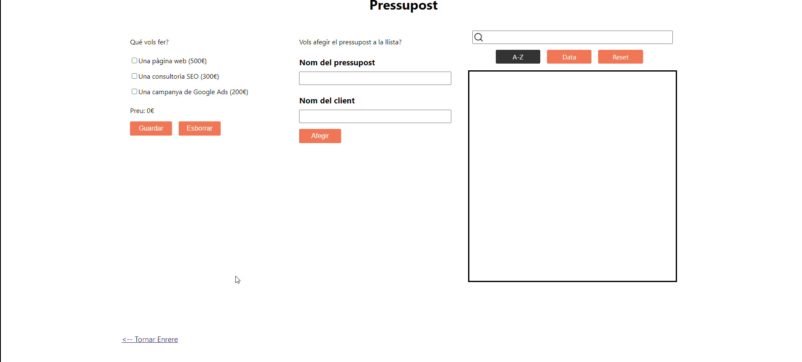

# Budget App

Aplicació per calcular el pressupost d'una pàgina web.

## Demo



## Install

```bash
# install dependencies
npm install

# Runs the app in the development mode
npm start

# Runs the app in the development mode.
npm run build
```

## Funcions de la App

<ol>
    <li>Creació de pressupostos per pàgines web.</li>
    <li>Triar nombre de pàgines i d'idiomes del lloc web.</li>
    <li>Guardar el pressupost creat en LocalStorage.</li>
    <li>Creació d'un llistat de pressupostos.</li>
    <li>Diverses options per ordenar el llistat.</li>
    <li>Filtrar el llistat de pressupostos per nom.</li>
    <li>Persistència de la llista de pressupostos creats.</li>
    <li>L'usuari pot compartir la URL del pressupost que esta creant.</li>
</ol>

## Licencia

[MIT](https://choosealicense.com/licenses/mit/)
